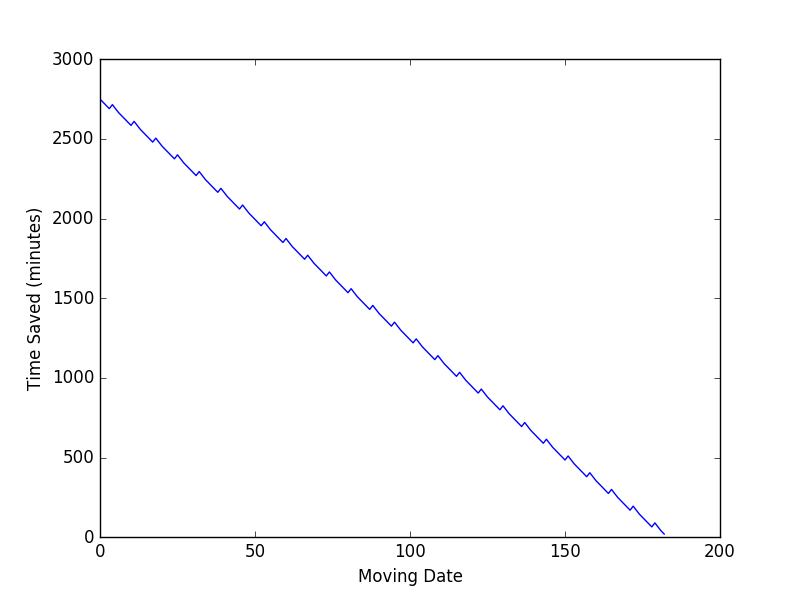

Collin McNulty

Introduction
============

Background
==========

Recently, my employer has moved offices from the East Side of Houston to the
West. Because Houston’s East Side is almost entirely industrial, my wife and I
currently live in an apartment in the town center, so my commute to the new
office has not increased, but there is an opportunity to move closer to the new
office and thus reduce our commutes. Additionally, the rent in the new area is
lower than we are currently paying. However, we are currently in a lease
agreement that lasts until June 1, 2017, so we would have to pay a penalty to
break the lease.

The penalty is not a fixed amount, but rather is a function of when the lease is
broken in the cycle and the time that it takes to re-rent the apartment.
Therefore, it was not obvious to me what the optimal strategy is in order to
maximize the time saved and minimize the additional expense incurred.

Original Problem Formulation
============================

Modelling
---------

This first formulation of the problem is based strongly on the actual
circumstances surrounding the move. The objectives were to maximize time saved
and minimize additional cost. These independent objectives were combined into
the following lexicographic minimum:

1.  All constraints met

2.  Maximize *Time Saved* per *Additional Cost*

3.  Maximize *Time Saved*

This enshrines the assumption that, in the area of the problem, utility is
linear with both time saved and additional cost.

The penalty for the move was formulated as a retroactive increase in the amount
of rent payed for the current apartment for all months in which we had stayed on
the current lease, plus 85% of the rent in the months before the apartment was
re-rented. The cost of the new apartment was, of course, also considered. Costs
of physically moving were not considered, as we will move at the end of the
lease in any scenario, so moving costs are not incremental. In that same spirit,
the cost of the “do nothing” option was subtracted from the cost objective.
Finally, all costs were converted from monthly costs to continuous time, to make
the function differentiable and non-flat at all points.

$$Cost = RetroactivePenalty + RerentFee + NewRent - Current\ Rent$$ (1)  
$$\text{Retroa}ctivePenalty = \left( CurrentLeaseStart - LeaseEnd
\right)*PenalizedRent$$ (2)  
$$ReRent\ Fee = MonthsUnrented*0.85*PenalizedRent$$ (3)  
$$NewRent = \left( FinalDate - \ NewLeaseStart \right)*\$ 825/month$$ (4)

For this first formulation, time saved was considered to be a linear function of
the number of days in the new apartment.

$$TimeSaved = \left( Final\ Date - MoveDate \right)*SavedPerDay$$ (5)

Thus, there are 3 design variables: *NewLeaseStart, LeaseEnd, and MoveDate*.

Constants are shown in Table 1.

Table 1: Constants

| Current Lease Start          | June 1, 2016 (-182) |
|------------------------------|---------------------|
| Penalized Rent               | \$1600/month        |
| Final Date                   | June 1, 2017 (183)  |
| New Rent                     | \$825/month         |
| Current Rent                 | \$1325/month        |
| Months Unrented (assumption) | 1.5 (45 days)       |
| Notice Required              | 60 days             |
| Current Date                 | Dec 1, 2016 (0)     |

The constraints are also based on the real moving situation. They are as
follows.

$$NewLeaseStart = < MoveDate = < LeaseEnd$$ (6)  
$$LeaseEnd > CurrentDate + Notice\ Required$$ (7)  
$$MoveDate > CurrentDate$$ (8)  
$$NewLeaseStart > CurrentDate$$ (9)

Solving
-------

The astute reader may notice that this problem has a simple obvious solution, or
at least an obvious pareto frontier. I assure that astute reader that the
solution seemed neither simple nor obvious to me at the time that I contemplated
and formulated this problem. Nevertheless, it can be plainly seen that
*MoveDate* should always be equal to *NewLeaseStart* as it is strictly
advantageous to *TimeSaved* and has no impact whatsoever on *Cost.* This will
prove to be the case in every formulation of the problem shown in this paper, so
it can be argued that this is really a two design variable problem. However, my
code treats it as a three variable problem, so I will give results for all
three. Perhaps more simplifying though, is that both maximization of *Time
Saved* and minimization of cost are improved with earlier dates for all three
design variables, and the equations are monotonic on the domain in question.
Once again, this was not apparent when the analysis was done.

Because the equations involve multiple pieces being combined in ways that I
wanted to be able to edit quickly, I restricted the methods used to solve the
problem to those that did not have to have an explicit derivative provided and
could make do with only function evaluations. I used the SciPy package in Python
for my optimization API.

Both the simplex algorithm and COBYLA were tested, and both arrived at the same
answer. I also took several point estimates for reference. These points and the
optimum are shown in Table 2. The code for this analysis is found in commit
4ed1c84.

Table 2: Values for Optimization of Original Formulation

| Lease End | New Lease | Move | Time Saved (minutes) | Housing Cost (\$) | Ratio |
|-----------|-----------|------|----------------------|-------------------|-------|
| 183       | 183       | 183  | 0                    | 3717.5            | 0     |
| 60        | 0         | 0    | 4967                 | 2189.5            | 2.27  |
| 60        | 60        | 60   | 3338                 | 540               | 6.18  |

Note that the point estimate for (183, 183, 183) corresponds to the “do nothing”
option, which means that it does not make sense for the *Cost*, which is
calculated relative to the do nothing, to be non-zero. This is because the
modelling does not account for values that do not incur penalties. By changing
the formulation to set the *RetroactivePenalty* to zero if *LeaseEnd ≥
FinalDate* and setting the *Months Unrented* to the maximum of the constant or
(Final Date – *LeaseEnd*), this can be fixed. This changes the objective space
to have two local optima, one corresponding to ending the lease early, and the
other for not doing so. These local optima are shown below. Note that
(183,183,183) now has an undefined ratio and thus objective function.

Table 3: Values for Correct Handling of Lease Penalty

| Lease End | New Lease | Move | Time Saved (minutes) | Housing Cost (\$) | Ratio     |
|-----------|-----------|------|----------------------|-------------------|-----------|
| 183       | 0         | 0    | 4967.14              | 5032.5            | 0.99      |
| 60        | 60        | 60   | 3338.57              | 540               | 6.18      |
| 183       | 183       | 183  | 0                    | 0                 | Undefined |

The global optimum is unchanged. Note that the point (183, 0, 0) must use the
entire lexicographic objective to be seen as the local optimum, any point (183,
x1, x2) where x1=x2 will have the same ratio. The code for this altered analysis
can be found in commit a2906cf.

Verification
------------

The point (60,60,60) makes sense as the optimal point. Indeed, it is obvious
once the problem is laid out clearly. The pareto frontier is defined by a
straight line between the points (60,0,0) and (60,60,60) in the original
objective function of maximize time, minimize cost. In the transformed space of
the time/money ratio, only the point (60,60,60) is pareto optimal. This makes
sense because, with increasingly earlier dates, up until (60, 60, 60), no
tradeoffs need to be made between the objectives, but after the *EndLease*
reaches its constraint, earlier dates in starting the new lease increase cost
and increase time savings, a tradeoff. This tradeoff occurs at a lower ratio
than is achievable at (60,60,60) so in the transformed space they are
suboptimal.

The local optimum showed in Table 3 corresponds to the strategy of simply paying
double rent and not ending the lease early. This makes sense because the penalty
undergoes a step change, so there should be at least 2 locally optimal points,
one on either side of the step. I had thought there might be some optimal point
in which the two leases would overlap for only a small period, but because the
time savings are linear, if they overlap for even one day, they may as well
overlap as much as possible.

In summary, the results match the common sense solution of moving as fast as
possible to minimize penalties while also avoiding the payment of double rent.
The KKT conditions for an exterior point are satisfied because there is no
feasible, improving direction around either local optimum.

Altered Problem Formulation
===========================

After completing the analysis above, I was concerned that one key objective had
yet to be optimized: my grade in this class. The problem turned out to be much
better behaved than I had initially imagined, and I was (and am) concerned that
it would not demonstrate my learning from this class. Therefore, I envisioned an
alternate cost penalty and time structure that would be more taxing, though not
relevant to my real world problem.

Note on the Impact of *Months Unrented*
---------------------------------------

My first attempt to complicate the problem was to account for the uncertainty in
*Months Unrented* to impact the solution. As a small test, I made the assumption
that the apartment would never be re-rented within the duration of the original
lease. This did not change the global or locally optimal strategies. The ratios
got worse, but they did not add complexity. Thus, the uncertainty only affects
the decision between the global optimum and the “do nothing”, whose objective is
undefined, which is an uninteresting question. I then abandoned this line of
inquiry.

Modelling
---------

The objective, constraints and constants remained the same in this new problem
formulation, but the equations for *Cost* and *Time* differ substantially.

For *Cost,* I imagined the penalty to be constructed in an opposite way, such
that the penalty would be incurred on months that were abandoned rather than the
months that were lived in. I also imagined that the penalty per day would be a
function of the day on which the lease was broken, so the *Cost* would be a
nonlinear function and would push the objective opposite the time savings.

$$Cost = Penalty + New\ Rent$$ (10)  
$$\text{Pena}lty = \ \sum_{1}^{183 - LeaseEnd}{(Penalty\lbrack day\rbrack)}\ \ \
+ LeaseEnd\ mod\ 1*Penalty\ \lbrack last\ day\rbrack$$ (11)  
$$\text{Penalty}\left\lbrack \text{day} \right\rbrack = \left( \frac{i}{183}
\right)PenalizedRent - \left( 1 - \frac{i}{183} \right)\text{CurrentRent}$$ (12)

The last term in Equation 11 ensures that the function is not composed of step
functions, which were found to confuse the solvers.

The *Time Saved* was reformatted to reflect the differences in time savings
based on the day of the week according to Table 4.

Table 4: Time Savings Schedule

| Sunday  | Monday  | Tuesday | Wednesday | Thursday | Friday  | Saturday |
|---------|---------|---------|-----------|----------|---------|----------|
| Save 25 | Lose 25 | Save 20 | Save 20   | Save 20  | Save 20 | Save 25  |

This schedule results in the following shape for *Time Saved:*

Figure 1: Time Saved in New Formulation

This new formulation therefore has many local optima, and the surface is
“bumpy”.

Solving
-------

The COBYLA solver proved to be unable to navigate the bumps, and got stuck in
local optima very frequently. I therefore switched to the SLSQP solver, which is
also in the SciPy API. I also tried a wide variety of initial points within the
space. This code is found in commit c9b77aa. Some of the local optima found are
shown in Table 5. These points show that the non-linearity of the cost had very
little impact on the optimum solutions. There was still a strongly linear
component, so the solver has trouble differentiating between points which are
along different parts of the cost curve. However, the non-linearity of time
actually controls the globally optimal point. (183, 179, 179) is the global
optimum because it never encounters the effect of losing time on a Monday. For
earlier dates, the time saved appears more smoothed, and so the optima are all
very similar \~=0.55.

One additional point is that in this case it is strictly better to not end the
lease early. There’s no reason to incur the penalty at all, because it always
costs more money and does not constrain from moving earlier. Therefore, only the
two points highlighted in blue are truly local optima satisfying KKT conditions.
All the other points have a feasible direction of improvement towards a later
date for lease end.

Table 5: Local Optima for Reformulated Problem

| Lease End | New Lease | Move | Time Saved | Housing Cost | Ratio | Solver Used |
|-----------|-----------|------|------------|--------------|-------|-------------|
| 71        | 60        | 60   | 1850       | 8589         | 0.22  | COBYLA      |
| 183       | 179       | 179  | 90         | 110          | 0.82  | SQSLP       |
| 170       | 0         | 0    | \-2750     | 5565         | 0.5   | SQSLP       |
| 183       | 0         | 0    | 2750       | 5032         | 0.55  | SQSLP       |
| 161       | 67        | 67   | 1770       | 3201         | 0.55  | SQSLP       |

Verification
------------

The value for the global optimum makes sense as it exploits the direction and
non-linearity of both objective components to the maximum degree possible. It
suggests that penalties can be avoided and a little extra time can be saved by
moving out a little early. It also highlights a weakness in the model, as in
order to get this most favorable tradeoff rate, one must trade only a little.
However, if a ratio of 0.55 was still “worth it”, one could make that trade in a
much higher volume. The pareto frontier in the original objective space is (183,
x1, x2) where x1=x2, as cost can be strictly decreased by increasing *LeaseEnd*
and *TimeSaved* can be independently increased by setting *MoveDate* equal to
*NewLease*.

Conclusions & Learnings
=======================

The optimal strategy in the first scenario is to end the lease as soon as
possible and begin a new lease and move as close to that date as possible as
defined by the point (60, 60, 60). The optimal strategy in the second scenario
is to not end the lease at all, and to move on the day after the last day that
the new location would cause a loss of time as defined by the point (183, 179,
179).

The parameters of the problem were not nearly as entangled as I had though they
were when coming up with the problem. In both formulations, the effects of time
and cost were significantly more independent than I thought, and could be
optimized more independently than it initially appeared. This has shown me the
value of the modelling and exploration step of optimization, as once I truly
understood the shape of the space, the optimum point was obvious.

Related to that unexpected simplicity, many of the effects that I had intended
to model became unnecessary. I am glad that I kept it simple to begin with, as
that simplicity enabled me to see that the core problem did not need to have
much of its uncertainty modelled, even though that uncertainty is part of why I
felt advanced techniques were needed to solve the problem. I was thus able to
use off-the-shelf solvers and still gain a solid understanding of the problem’s
dynamics. (I wish I had gotten reason to demonstrate comparisons of more
advanced techniques for purposes of the project originality and difficulty
requirement, but the problem simply didn’t lend itself to that.)

Appendix
========
